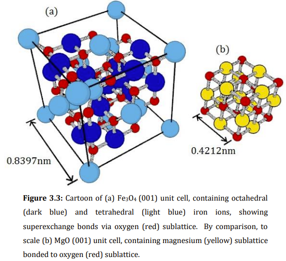
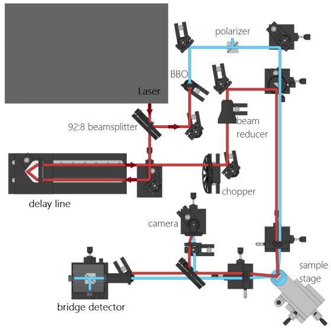

</img>

## Hi, I'm James - Welcome to my GitHub Profile

 

---

I'm a Physicist turned Fullstack Software [Architect](https://www.credly.com/badges/801c05b2-eac3-44e2-8531-f0cf6c12d972/linked_in_profile) and Technical Lead.  I'm passionate about System Design, Data Capture and [Psychological Safety](https://rework.withgoogle.com/guides/understanding-team-effectiveness/steps/foster-psychological-safety/).

I design and build automated test systems, and write & architect LabVIEW (among other things) software for Dyson's product R&D, across multiple categories and countries.

I specialise in cRIO RT & FPGA embedded test solutions along with machine vision and robotic control (Universal Robots are great!!). My test equipment has featured in several Dyson media launches.

But I am now falling in love with Rust and TypeScript.

---

<!-- Skills as a table -->
### I love to learn new things

<table>
<tr style="display: grid; grid-template-columns: auto auto auto auto auto">
<td></td>
<td></td>
<td></td>
<td></td>
<td></td>
<td></td>
<td></td>
<!-- <td></td> -->
</tr>
</table>

<!-- Github Stats, coding streak, Most used languages analytics-->

---
[My PhD Thesis](https://etheses.whiterose.ac.uk/16626/)

 
 

