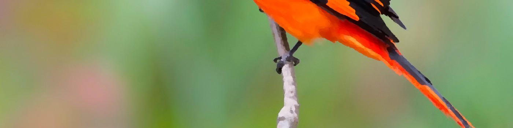

</img>

## Hi, I'm James - Welcome to my GitHub Profile

 

---

## About Me

PhD physicist turned self-taught multi-language full-stack software tech lead. I thrive on solving problems and developing technological and organizational systems, with a people first approach.  I'm passionate about System Design, Data Capture and [Psychological Safety](https://rework.withgoogle.com/guides/understanding-team-effectiveness/steps/foster-psychological-safety/).

I design and build high-fidelity prototype products, using Embedded Rust, TypeScript React and Golang for Dyson's product R&D.  I'm also helping to build an Embedded Rust BLE library, [TrouBLE](https://github.com/embassy-rs/trouble).

<!-- Skills as a table -->
### I love to learn new things

<table>
<tr style="display: grid; grid-template-columns: auto auto auto auto auto">
<td></td>
<td></td>
<td></td>
<td></td>
<td></td>
<td></td>
</tr>
</table>

### Personal Projects

| Project | Description | Links |
| --- | --- | --- |
| Chase Me | Arcade game written in [Bevy](https://bevyengine.org/) game engine.  Learning about game loops and Entity Component System models. | [repo](https://github.com/jamessizeland/bevy-chase-me-game), [play](https://jamessizeland.github.io/bevy-chase-me-game/) |
| Chess App | Written in the [Tauri](https://tauri.app/) cross-platform app framework. | [repo](https://github.com/jamessizeland/tauri-chess) |
| BLE Gamepad | Async Embedded Rust project with [Embassy](https://github.com/embassy-rs/embassy) and [TrouBLE](https://github.com/embassy-rs/trouble). | [repo](https://github.com/jamessizeland/Rust-BLE-embedded-gamepad) |

---

<!-- Github Stats, coding streak, Most used languages analytics-->

---

---

[My PhD Thesis](https://etheses.whiterose.ac.uk/16626/)

 
 

